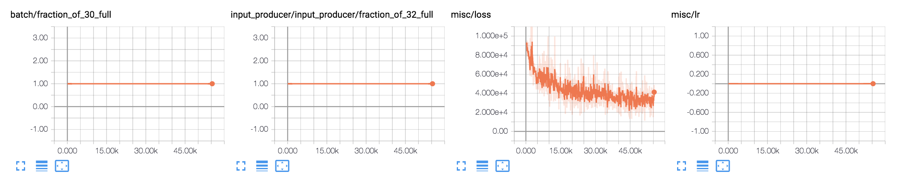
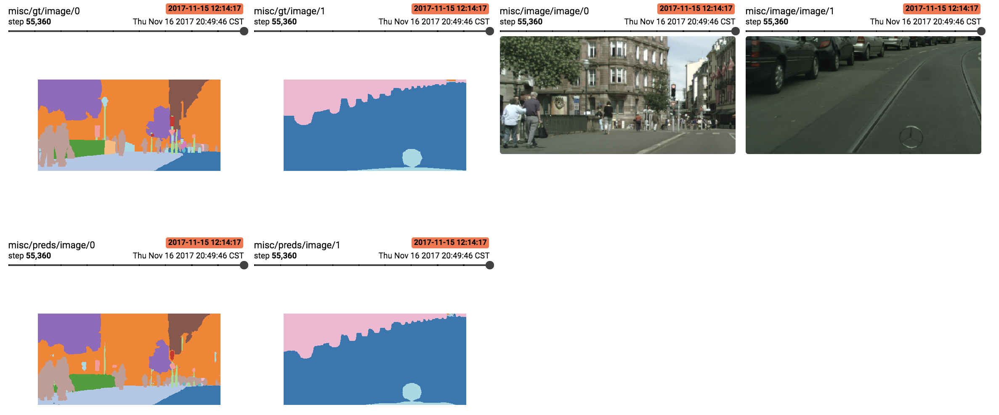

# FRRN Tensorflow

## Intro

This repository contains code implementing the paper, [Full Resolution Residual Networks for Semantic Segmentation in Street Scenes](https://arxiv.org/abs/1611.08323) (FRRN) in Tensorflow.

:warning: This is not an official implementation, and might have some glitch (,or a major defect).

## Requirements

- Python 3.5.2 (or higher)
- Tensorflow v1.3 (or higher)
- Numpy
- PIL,Matplotlib,numpy,tqdm,better_exceptions,...

## Training from scratch

### Dataset preprocessing

1. Donwload [datasets](https://www.cityscapes-dataset.com/downloads/)(`gtFine_trainvaltest.zip`, `leftImg8bit_trainvaltest.zip`) and unzip under the directory dataset
  - Make sure that path look like `./datasets/cityspaces/gtFine` and `./datasets/cityspaces/leftImg8bit`.
2. Run the script to generate TrainId format images.
  - `python cityscapesScripts/cityscapesscripts/preparation/createTrainIdLabelImgs.py`

### Run training

- Run, `python main.py`
- If you want to change some hyperparameters, then check the config dictionary on the `main.py`.

### Run evaluation

- Comment out the `main()` at the second last line on the `main.py` and uncomment the last line, `eval()`.
- Then, Run `python main.py`.

## Trained Results

The training is done with nVidia Quadro M4000 GPU (8GB of V-RAM). I can fit 3 batches with Type A architecture.
I ran this about 32 hours for about 55k iterations. Below is the learning statistics, and some results on training set.

### Training statistics






### Result on the Validation Set

Below is the validation set result. I could get mIOU of 0.570.

```
❯❯❯ python cityscapesScripts/cityscapesscripts/evaluation/evalPixelLevelSemanticLabeling.py

Evaluating 500 pairs of images...
Images Processed: 500

-------------- ------ ------ ------ ------ ------ ------ ------ ------ ------ ------ ------ ------ ------ ------ ------ ------ ------ ------ ------ ------ ------ ------ ------ ------ ------ ------ ------ ------ ------ ------ ------ ------ ------ ------ -------
              |  u   |  e   |  r   |  o   |  s   |  d   |  g   |  r   |  s   |  p   |  r   |  b   |  w   |  f   |  g   |  b   |  t   |  p   |  p   |  t   |  t   |  v   |  t   |  s   |  p   |  r   |  c   |  t   |  b   |  c   |  t   |  t   |  m   |  b   | Prior |
-------------- ------ ------ ------ ------ ------ ------ ------ ------ ------ ------ ------ ------ ------ ------ ------ ------ ------ ------ ------ ------ ------ ------ ------ ------ ------ ------ ------ ------ ------ ------ ------ ------ ------ ------ -------
    unlabeled | 0.01   0.00   0.00   0.00   0.00   0.00   0.00   0.00   0.00   0.00   0.00   0.10   0.00   0.00   0.00   0.00   0.00   0.01   0.00   0.00   0.00   0.03   0.00   0.84   0.00   0.00   0.00   0.00   0.00   0.00   0.00   0.00   0.00   0.00  0.0004
  ego vehicle | 0.90   0.00   0.00   0.00   0.00   0.00   0.00   0.10   0.00   0.00   0.00   0.00   0.00   0.00   0.00   0.00   0.00   0.00   0.00   0.00   0.00   0.00   0.00   0.00   0.00   0.00   0.00   0.00   0.00   0.00   0.00   0.00   0.00   0.00  0.0490
rectification | 0.86   0.00   0.00   0.00   0.00   0.00   0.00   0.02   0.00   0.00   0.00   0.07   0.00   0.00   0.00   0.00   0.00   0.00   0.00   0.00   0.01   0.02   0.00   0.01   0.00   0.00   0.00   0.00   0.00   0.00   0.00   0.00   0.00   0.00  0.0189
   out of roi | 0.39   0.00   0.00   0.00   0.00   0.00   0.00   0.14   0.04   0.00   0.00   0.18   0.00   0.00   0.00   0.00   0.00   0.01   0.00   0.00   0.01   0.13   0.00   0.05   0.00   0.00   0.04   0.00   0.00   0.00   0.00   0.00   0.00   0.00  0.0151
       static | 0.28   0.00   0.00   0.00   0.00   0.00   0.00   0.00   0.03   0.00   0.00   0.39   0.00   0.02   0.00   0.00   0.00   0.05   0.00   0.00   0.07   0.08   0.00   0.01   0.01   0.00   0.03   0.00   0.00   0.00   0.00   0.00   0.00   0.02  0.0149
      dynamic | 0.33   0.00   0.00   0.00   0.00   0.00   0.00   0.01   0.02   0.00   0.00   0.35   0.00   0.03   0.00   0.00   0.00   0.02   0.00   0.00   0.01   0.03   0.00   0.01   0.06   0.01   0.06   0.00   0.00   0.00   0.00   0.00   0.02   0.04  0.0042
       ground | 0.03   0.00   0.00   0.00   0.00   0.00   0.00   0.54   0.39   0.00   0.00   0.00   0.00   0.00   0.00   0.00   0.00   0.00   0.00   0.00   0.00   0.00   0.03   0.00   0.00   0.00   0.00   0.00   0.00   0.00   0.00   0.00   0.00   0.00  0.0178
         road | 0.00   0.00   0.00   0.00   0.00   0.00   0.00   0.98   0.01   0.00   0.00   0.00   0.00   0.00   0.00   0.00   0.00   0.00   0.00   0.00   0.00   0.00   0.00   0.00   0.00   0.00   0.00   0.00   0.00   0.00   0.00   0.00   0.00   0.00  0.3293
     sidewalk | 0.02   0.00   0.00   0.00   0.00   0.00   0.00   0.09   0.85   0.00   0.00   0.01   0.00   0.00   0.00   0.00   0.00   0.00   0.00   0.00   0.00   0.00   0.01   0.00   0.00   0.00   0.00   0.00   0.00   0.00   0.00   0.00   0.00   0.00  0.0473
      parking | 0.25   0.00   0.00   0.00   0.00   0.00   0.00   0.51   0.18   0.00   0.00   0.00   0.00   0.00   0.00   0.00   0.00   0.00   0.00   0.00   0.00   0.00   0.01   0.00   0.00   0.00   0.04   0.00   0.00   0.00   0.00   0.00   0.00   0.00  0.0040
   rail track | 0.18   0.00   0.00   0.00   0.00   0.00   0.00   0.67   0.11   0.00   0.00   0.00   0.00   0.00   0.00   0.00   0.00   0.00   0.00   0.00   0.00   0.00   0.03   0.00   0.00   0.00   0.00   0.00   0.00   0.00   0.00   0.00   0.00   0.00  0.0006
     building | 0.01   0.00   0.00   0.00   0.00   0.00   0.00   0.00   0.00   0.00   0.00   0.93   0.00   0.00   0.00   0.00   0.00   0.01   0.00   0.00   0.01   0.02   0.00   0.01   0.00   0.00   0.00   0.00   0.00   0.00   0.00   0.00   0.00   0.00  0.1917
         wall | 0.12   0.00   0.00   0.00   0.00   0.00   0.00   0.06   0.09   0.00   0.00   0.28   0.22   0.10   0.00   0.00   0.00   0.01   0.00   0.00   0.00   0.09   0.01   0.00   0.01   0.00   0.01   0.00   0.00   0.00   0.00   0.00   0.00   0.00  0.0064
        fence | 0.10   0.00   0.00   0.00   0.00   0.00   0.00   0.00   0.02   0.00   0.00   0.27   0.01   0.47   0.00   0.00   0.00   0.03   0.00   0.00   0.01   0.06   0.00   0.00   0.01   0.00   0.01   0.00   0.00   0.00   0.00   0.00   0.00   0.01  0.0072
   guard rail | 0.34   0.00   0.00   0.00   0.00   0.00   0.00   0.01   0.10   0.00   0.00   0.00   0.00   0.27   0.00   0.00   0.00   0.00   0.00   0.00   0.00   0.03   0.21   0.00   0.00   0.00   0.04   0.00   0.00   0.00   0.00   0.00   0.00   0.00  0.0000
       bridge | 0.52   0.00   0.00   0.00   0.00   0.00   0.00   0.00   0.00   0.00   0.00   0.32   0.00   0.04   0.00   0.00   0.00   0.01   0.00   0.00   0.00   0.09   0.00   0.00   0.00   0.00   0.01   0.00   0.00   0.00   0.00   0.00   0.00   0.00  0.0003
         pole | 0.04   0.00   0.00   0.00   0.00   0.00   0.00   0.00   0.01   0.00   0.00   0.17   0.00   0.01   0.00   0.00   0.00   0.63   0.00   0.00   0.01   0.09   0.00   0.00   0.01   0.00   0.01   0.00   0.00   0.00   0.00   0.00   0.00   0.01  0.0129
    polegroup | 0.14   0.00   0.00   0.00   0.00   0.00   0.00   0.00   0.04   0.00   0.00   0.21   0.00   0.22   0.00   0.00   0.00   0.23   0.00   0.00   0.01   0.03   0.01   0.00   0.05   0.00   0.01   0.00   0.00   0.00   0.00   0.00   0.00   0.04  0.0001
traffic light | 0.07   0.00   0.00   0.00   0.00   0.00   0.00   0.00   0.00   0.00   0.00   0.29   0.00   0.00   0.00   0.00   0.00   0.07   0.00   0.38   0.02   0.15   0.00   0.01   0.00   0.00   0.00   0.00   0.00   0.00   0.00   0.00   0.00   0.00  0.0017
 traffic sign | 0.04   0.00   0.00   0.00   0.00   0.00   0.00   0.00   0.00   0.00   0.00   0.08   0.00   0.01   0.00   0.00   0.00   0.01   0.00   0.00   0.80   0.04   0.00   0.00   0.00   0.00   0.01   0.00   0.00   0.00   0.00   0.00   0.00   0.00  0.0058
   vegetation | 0.00   0.00   0.00   0.00   0.00   0.00   0.00   0.00   0.00   0.00   0.00   0.02   0.00   0.00   0.00   0.00   0.00   0.00   0.00   0.00   0.00   0.96   0.01   0.00   0.00   0.00   0.00   0.00   0.00   0.00   0.00   0.00   0.00   0.00  0.1515
      terrain | 0.03   0.00   0.00   0.00   0.00   0.00   0.00   0.04   0.14   0.00   0.00   0.01   0.01   0.01   0.00   0.00   0.00   0.00   0.00   0.00   0.00   0.12   0.64   0.00   0.00   0.00   0.00   0.00   0.00   0.00   0.00   0.00   0.00   0.00  0.0073
          sky | 0.01   0.00   0.00   0.00   0.00   0.00   0.00   0.00   0.00   0.00   0.00   0.02   0.00   0.00   0.00   0.00   0.00   0.00   0.00   0.00   0.00   0.02   0.00   0.94   0.00   0.00   0.00   0.00   0.00   0.00   0.00   0.00   0.00   0.00  0.0293
       person | 0.02   0.00   0.00   0.00   0.00   0.00   0.00   0.01   0.01   0.00   0.00   0.05   0.00   0.00   0.00   0.00   0.00   0.01   0.00   0.00   0.00   0.01   0.00   0.00   0.83   0.02   0.02   0.00   0.00   0.00   0.00   0.00   0.00   0.01  0.0114
        rider | 0.01   0.00   0.00   0.00   0.00   0.00   0.00   0.00   0.00   0.00   0.00   0.03   0.00   0.00   0.00   0.00   0.00   0.00   0.00   0.00   0.00   0.02   0.00   0.00   0.17   0.59   0.04   0.00   0.00   0.00   0.00   0.00   0.04   0.11  0.0019
          car | 0.01   0.00   0.00   0.00   0.00   0.00   0.00   0.01   0.00   0.00   0.00   0.01   0.00   0.00   0.00   0.00   0.00   0.00   0.00   0.00   0.00   0.01   0.00   0.00   0.00   0.00   0.96   0.00   0.00   0.00   0.00   0.00   0.00   0.00  0.0570
        truck | 0.06   0.00   0.00   0.00   0.00   0.00   0.00   0.01   0.00   0.00   0.00   0.07   0.00   0.00   0.00   0.00   0.00   0.00   0.00   0.00   0.01   0.01   0.00   0.05   0.00   0.00   0.29   0.49   0.00   0.00   0.00   0.00   0.00   0.00  0.0026
          bus | 0.07   0.00   0.00   0.00   0.00   0.00   0.00   0.01   0.00   0.00   0.00   0.07   0.00   0.01   0.00   0.00   0.00   0.00   0.00   0.00   0.03   0.02   0.00   0.00   0.00   0.00   0.24   0.21   0.31   0.00   0.00   0.03   0.00   0.00  0.0034
      caravan | 0.12   0.00   0.00   0.00   0.00   0.00   0.00   0.01   0.00   0.00   0.00   0.09   0.00   0.00   0.00   0.00   0.00   0.01   0.00   0.00   0.00   0.05   0.00   0.00   0.00   0.00   0.19   0.53   0.00   0.00   0.00   0.00   0.00   0.00  0.0001
      trailer | 0.32   0.00   0.00   0.00   0.00   0.00   0.00   0.01   0.01   0.00   0.00   0.12   0.00   0.00   0.00   0.00   0.00   0.01   0.00   0.00   0.00   0.03   0.00   0.00   0.00   0.00   0.45   0.05   0.00   0.00   0.00   0.00   0.01   0.00  0.0002
        train | 0.06   0.00   0.00   0.00   0.00   0.00   0.00   0.00   0.00   0.00   0.00   0.29   0.00   0.01   0.00   0.00   0.00   0.01   0.00   0.00   0.00   0.03   0.00   0.01   0.00   0.00   0.03   0.02   0.23   0.00   0.00   0.31   0.00   0.00  0.0010
   motorcycle | 0.05   0.00   0.00   0.00   0.00   0.00   0.00   0.00   0.01   0.00   0.00   0.03   0.00   0.01   0.00   0.00   0.00   0.01   0.00   0.00   0.00   0.01   0.00   0.00   0.04   0.05   0.26   0.00   0.00   0.00   0.00   0.00   0.36   0.17  0.0007
      bicycle | 0.02   0.00   0.00   0.00   0.00   0.00   0.00   0.00   0.01   0.00   0.00   0.03   0.00   0.01   0.00   0.00   0.00   0.01   0.00   0.00   0.00   0.01   0.00   0.00   0.02   0.02   0.04   0.00   0.00   0.00   0.00   0.00   0.03   0.79  0.0062
-------------- ------ ------ ------ ------ ------ ------ ------ ------ ------ ------ ------ ------ ------ ------ ------ ------ ------ ------ ------ ------ ------ ------ ------ ------ ------ ------ ------ ------ ------ ------ ------ ------ ------ ------ -------

classes          IoU      nIoU
--------------------------------
road          : 0.963      nan
sidewalk      : 0.736      nan
building      : 0.873      nan
wall          : 0.209      nan
fence         : 0.382      nan
pole          : 0.515      nan
traffic light : 0.359      nan
traffic sign  : 0.617      nan
vegetation    : 0.898      nan
terrain       : 0.527      nan
sky           : 0.884      nan
person        : 0.714    0.522
rider         : 0.449    0.339
car           : 0.896    0.805
truck         : 0.349    0.194
bus           : 0.289    0.197
train         : 0.277    0.132
motorcycle    : 0.239    0.155
bicycle       : 0.658    0.507
--------------------------------
Score Average : 0.570    0.356
--------------------------------


categories       IoU      nIoU
--------------------------------
flat          : 0.975      nan
nature        : 0.900      nan
object        : 0.560      nan
sky           : 0.884      nan
construction  : 0.875      nan
human         : 0.739    0.563
vehicle       : 0.891    0.788
--------------------------------
Score Average : 0.832    0.675
--------------------------------
```

### Notes (Implementation Differences)

- Only implmented the Type A architecture; but it is very straight forward to implement the other version.
- I randomly cropped the image of 1/4 area from original images and then resize images by its width and height by half for training.
  - Therefore, the prediction is done by half scale, unlike the paper where prediction is made at 1/4 scale with Type A architecture.
  - No translation-based augmentation is made. (Beta-augmentation is implmented.)
  - By doing that, I keep the same input size to the paper, while prediction scale is doubled to the paper. It can be done since it is fully convolutional architecture.
    - Nevertheless, it might be the reason why the trained model is worse than the author could get.
    - Global context, maybe is more important for fine-grained predictions.
- No separated gradient descent step is required.
  - I can barely fit up to 3 batches on 8GB V-Ram with Type A.
- About hyperparams:
  - No learning rate deacy is applied.
  - K could be a value to be tuned carefully.
- Pretrained model is available upon request.

## Acknowledgement

- Author's original implementation in Theano with Lasagne[link](https://github.com/TobyPDE/FRRN)

